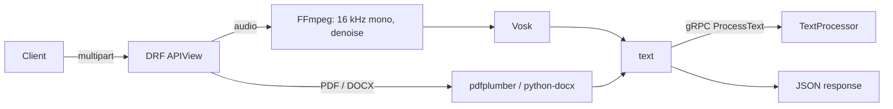

# API Processor

[Русский](README.md) · **English**

[](https://github.com/EDeev/api_processor/actions/workflows/ci.yml)
[](https://github.com/EDeev/api_processor/actions/workflows/docker.yml)
[](LICENSE)

A REST API that turns audio and documents into text:
- speech is recognized offline with a Vosk model;
- text, tables and images are extracted from PDF and DOCX.

The result can be forwarded over gRPC to a text processing service. Speech recognition targets Russian.

**Status:** personal project, completed

**Stack:** Python 3.12 · Django 5.2 · Django REST Framework · Vosk · FFmpeg · pdfplumber · python-docx · gRPC · Docker

## Features

- **Audio → text.** Any format FFmpeg reads (OGG, MP3, M4A, WAV…). Audio is converted to 16 kHz mono with
  noise reduction and loudness normalization first. Recognition is offline, no external services.
- **Document → HTML.** PDF and DOCX: paragraphs in `<p>`, tables as CSV in `<pre>`, images as base64. The
  document text is escaped, so the result is safe to render in a browser.
- **gRPC.** The text is sent to the `TextProcessor` service (`proto/text_service.proto`), and its reply is
  returned in `grpc_response`. If no service address is set, the step is skipped.
- Optional access token and a file size limit (50 MB by default).

## API

```bash
curl -F audio=@examples/sample.ogg http://localhost:8000/api/audio-to-text/
curl -F document=@report.pdf http://localhost:8000/api/document-to-text/
```

```json
{
  "text": "раз два три проверка перевода голоса текст насколько качественно она работает один два три четыре пять шесть семь восемь девять десять",
  "grpc_response": null
}
```

With `API_TOKEN` set, add `Authorization: Bearer <token>`. Errors come as `{"error": "..."}`:

| Code | When |
|---|---|
| 400 | no file or unsupported document format |
| 403 | wrong token |
| 413 | file over the limit |
| 422 | audio could not be read |

## Running

```bash
git clone https://github.com/EDeev/api_processor.git && cd api_processor
cp .env.example .env      # set DJANGO_SECRET_KEY
docker compose up -d      # API at http://localhost:8000
```

The Vosk model and FFmpeg are inside the image. Prebuilt image: `docker pull ghcr.io/edeev/api_processor` or
`docker pull git.deev.su/edeev/api_processor`.

Without Docker you need:
- FFmpeg in `PATH`;
- the [vosk-model-small-ru-0.22](https://alphacephei.com/vosk/models) model unpacked into `models/`.

Then:

```bash
pip install -r requirements.txt
DJANGO_DEBUG=True python manage.py migrate
DJANGO_DEBUG=True python manage.py runserver
```

| Variable | Purpose |
|---|---|
| `DJANGO_SECRET_KEY` | secret key, required unless `DJANGO_DEBUG=True` |
| `DJANGO_ALLOWED_HOSTS` | comma-separated domains |
| `API_TOKEN` | if set, access requires the token |
| `GRPC_SERVER`, `GRPC_TIMEOUT` | TextProcessor address and timeout, s |
| `MAX_UPLOAD_SIZE_MB` | file size limit |
| `VOSK_MODEL_PATH`, `FFMPEG_BINARY` | paths to the model and ffmpeg |

## How it works



The Vosk model is loaded once per process. Each request gets its own temporary file. Uploaded files and
results are stored in SQLite and `media/`.

## Development

```bash
pip install -r requirements-dev.txt
ruff check --select E9,F,B --exclude proto . && pytest
```

What the tests cover:
- recognition of the whole sample, with every phrase;
- OGG conversion;
- PDF and DOCX extraction with escaping;
- limits and the token;
- a real gRPC server and an unavailable one.

The Docker image is built on `v*` tags and published to GitHub Packages and `git.deev.su`.

## License

MIT — see [LICENSE](LICENSE). The Vosk model is licensed under Apache 2.0.

## Author

**Egor Deev** — [GitHub](https://github.com/EDeev) · [Telegram](https://t.me/DeevEgor) · [egor@deev.space](mailto:egor@deev.space)

---

<div align="center">
  <sub>⭐ If you find this project useful, give it a star on GitHub!</sub>
  <p><sub>Made with ❤️ — <a href="https://deev.space">deev.space</a></sub></p>
</div>
