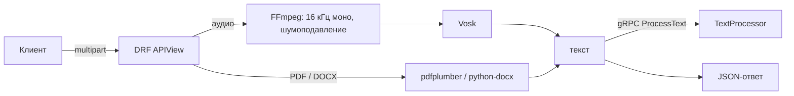

# API Processor

**Русский** · [English](README.en.md)

[](https://github.com/EDeev/api_processor/actions/workflows/ci.yml)
[](https://github.com/EDeev/api_processor/actions/workflows/docker.yml)
[](LICENSE)

REST API, которое превращает аудио и документы в текст:
- речь распознаётся офлайн моделью Vosk;
- из PDF и DOCX извлекаются текст, таблицы и изображения.

Результат можно отправить дальше по gRPC — на сервис обработки текста.

**Статус:** личный проект, завершён

**Стек:** Python 3.12 · Django 5.2 · Django REST Framework · Vosk · FFmpeg · pdfplumber · python-docx · gRPC · Docker

## Возможности

- **Аудио → текст.** Любой формат, который читает FFmpeg (OGG, MP3, M4A, WAV…). Перед распознаванием
  звук приводится к 16 кГц моно с шумоподавлением и нормализацией громкости. Распознавание офлайн, без
  внешних сервисов.
- **Документ → HTML.** PDF и DOCX: абзацы — в `<p>`, таблицы — CSV в `<pre>`, изображения — в base64.
  Текст документа экранируется, поэтому результат безопасно показывать в браузере.
- **gRPC.** Распознанный текст уходит на сервис `TextProcessor` (`proto/text_service.proto`), его ответ
  возвращается в поле `grpc_response`. Если адрес сервиса не задан, шаг пропускается.
- Необязательный токен доступа и ограничение размера файла (по умолчанию 50 МБ).

## API

```bash
curl -F audio=@examples/sample.ogg http://localhost:8000/api/audio-to-text/
curl -F document=@report.pdf http://localhost:8000/api/document-to-text/
```

```json
{
  "text": "раз два три проверка перевода голоса текст насколько качественно она работает один два три четыре пять шесть семь восемь девять десять",
  "grpc_response": null
}
```

Если задан `API_TOKEN`, добавьте заголовок `Authorization: Bearer <токен>`. Ошибки приходят как
`{"error": "..."}`:

| Код | Когда |
|---|---|
| 400 | нет файла или неподдерживаемый формат документа |
| 403 | неверный токен |
| 413 | файл больше лимита |
| 422 | аудио не удалось прочитать |

## Запуск

```bash
git clone https://github.com/EDeev/api_processor.git && cd api_processor
cp .env.example .env      # задайте DJANGO_SECRET_KEY
docker compose up -d      # API на http://localhost:8000
```

Модель Vosk и FFmpeg уже внутри образа. Готовый образ: `docker pull ghcr.io/edeev/api_processor` или
`docker pull git.deev.su/edeev/api_processor`.

Без Docker нужны:
- FFmpeg в `PATH`;
- модель [vosk-model-small-ru-0.22](https://alphacephei.com/vosk/models), распакованная в `models/`.

Затем:

```bash
pip install -r requirements.txt
DJANGO_DEBUG=True python manage.py migrate
DJANGO_DEBUG=True python manage.py runserver
```

| Переменная | Назначение |
|---|---|
| `DJANGO_SECRET_KEY` | секретный ключ, обязателен без `DJANGO_DEBUG=True` |
| `DJANGO_ALLOWED_HOSTS` | домены через запятую |
| `API_TOKEN` | если задан — доступ только с токеном |
| `GRPC_SERVER`, `GRPC_TIMEOUT` | адрес сервиса TextProcessor и таймаут, с |
| `MAX_UPLOAD_SIZE_MB` | лимит размера файла |
| `VOSK_MODEL_PATH`, `FFMPEG_BINARY` | путь к модели и к ffmpeg |

## Как устроено



```
api_app/views.py                      эндпоинты и проверки
api_app/services/vosk_recognizer.py   конвертация FFmpeg и распознавание Vosk
api_app/services/scan.py              извлечение из PDF и DOCX
api_app/grpc_client/client.py         клиент TextProcessor
proto/                                описание gRPC-сервиса и сгенерированный код
```

Модель Vosk загружается один раз на процесс. У каждого запроса свой временный файл. Загруженные файлы и
результат сохраняются в SQLite и `media/`.

## Разработка

```bash
pip install -r requirements-dev.txt
ruff check --select E9,F,B --exclude proto . && pytest
```

Что проверяют тесты:
- распознавание образца целиком, со всеми фразами;
- конвертацию OGG;
- извлечение из PDF и DOCX с экранированием;
- лимиты и токен;
- работу с настоящим gRPC-сервером и его недоступность.

Docker-образ собирается по тегу `v*` и публикуется в GitHub Packages и `git.deev.su`.

Код gRPC пересобирается так:
`python -m grpc_tools.protoc -Iproto --python_out=proto --grpc_python_out=proto proto/text_service.proto`.

## Лицензия

MIT — см. [LICENSE](LICENSE). Модель Vosk распространяется под Apache 2.0.

## Автор

**Деев Егор Викторович** — [GitHub](https://github.com/EDeev) · [Telegram](https://t.me/DeevEgor) · [egor@deev.space](mailto:egor@deev.space)

---

<div align="center">
  <sub>⭐ Если проект оказался полезным, поставьте звёздочку на GitHub!</sub>
  <p><sub>Сделано с ❤️ — <a href="https://deev.space">deev.space</a></sub></p>
</div>
